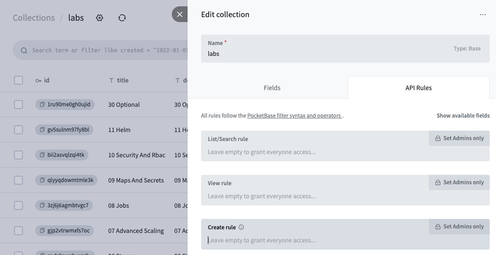

# KubeLab: The Ultimate Kubernetes Learning Platform 

<p align="center">
    <a href="https://kubelab.natron.io">
        
    </a>
</p>

<p align="center">
  <strong>
    <a href="https://kubelab.natron.io/">KubeLab</a>
    <br />
    Embark on your Kubernetes Journey through Hands-on Practice
  </strong>
</p>

<p align="center">
  <a href="https://github.com/natrontech/kubelab/issues"></a>
  <a href="https://github.com/natrontech/kubelab"></a>
  
  
  
  
</p>

<h2></h2>

Welcome to KubeLab! Our advanced web-based platform offers a rich set of interactive labs, specifically crafted for Kubernetes workshops. We aim to revolutionize your learning experience by making it more interactive, engaging, and practical. Our labs will help you grasp and apply complex Kubernetes concepts in a real-world context.

KubeLab is a proud offering by [Natron Tech](https://natron.io), and if you're interested in a tailor-made Kubernetes services or workshops for your company, do not hesitate to reach out to us!

KubeLab is built using:

- [kubelab-agent](https://github.com/natrontech/kubelab-agent)
- [xterm.js](https://xtermjs.org/)
- [code-server](https://docs.linuxserver.io/images/docker-code-server/)
- [pocketbase](https://pocketbase.io)
- [vcluster](https://vcluster.com)

<p align="center">
	
</p>

**Please note:** This project is still in its early stages, and we're diligently working to enhance your experience. However, bugs might appear, and your patience and feedback will be greatly appreciated.

---

## Cloud Version

You can access the cloud version of KubeLab at [kubelab.ch](https://kubelab.ch). This version is hosted by us. As of security reasons, we do not let you to sign up for the cloud version. If you want to use KubeLab for your company, please contact us at [info@natron.io](mailto:info@natron.io). Also, when you want to host a KubeLab instance for your company, we can provide you with a hosted version of KubeLab.

## Features

### Web Terminal

KubeLab features a smooth in-browser terminal, letting you execute commands and interact with your Kubernetes cluster in real-time, without needing any additional setup or software.

### Code Editor

KubeLab comes with a vscode-based code editor, allowing you to edit and run code directly from your browser. The editor supports syntax highlighting, code completion, and more. Watch out for the code editor button in the bottom left corner of your screen.

### Dedicated Cluster Per Session

Every learning session on KubeLab has its own isolated Kubernetes cluster. This design ensures a secure and dedicated learning environment, enabling you to experiment with Kubernetes without impacting others.

### Custom Kubernetes Labs

With KubeLab, you can define your own labs and exercises. Check out our workshops [here](https://github.com/natrontech/kubelab-workshops).
All the labs and exercises follow the same structure and can be easily created and shared.

The structure of a lab with an exercise is as follows:
```bash
kubelab-workshops/kubernetes-basics # Example workshop
└── 01_introduction # Name of the lab
    ├── 01_get_kubectl_version # Name of the exercise
    │   ├── bootstrap.sh # The script that will be executed when the exercise starts
    │   ├── check.sh # The script that will be executed to check if the exercise is solved
    │   ├── docs.md # The text that will be displayed to the user
    │   ├── hint.md # The hint that will be displayed to the user
    │   └── solution.md # The solution that will be displayed to the user
    └── docs.md # The text that will be displayed to the user for the lab
```

### Workshop Mode

KubeLab offers a workshop mode, allowing you to hold your own Kubernetes workshops. Each user can have the `workshop` set to `true` and a `company` assigned. This will allow you to filter the users by company and see their progress. Then you can create a user with the role `admin` and when you log in with this user you can see the dashboards of all the companies. The users then also have an addional `request for help` button in the UI which will send a real-time notification to the dashboard.

---

## Development

Interested in contributing to KubeLab? Please make sure you have the following prerequisites:

- [Docker](https://docs.docker.com/get-docker/)
- [Docker Compose](https://docs.docker.com/compose/install/)
- [Node.js](https://nodejs.org/en/download/) (v18+)
- [Go](https://golang.org/doc/install) (v1.21+)
- [modd](https://github.com/cortesi/modd/releases)

Please refer to our detailed development guides for the [backend](./kubelab-backend/README.md) and [frontend](./kubelab-ui/README.md) to get started. For contributing, please read our [CONTRIBUTING.md](CONTRIBUTING.md) for information on code conduct and the process for submitting pull requests.

## Deployment

To get started, ensure that you have a Kubernetes cluster (v1.27+).

1. Take a look at the [deployment](./deployment) folder for an example deployment.
2. Create a wildcard certificate and store it in a secret. (You can use [cert-manager](https://cert-manager.io/docs/) for this)

	```yaml
	apiVersion: cert-manager.io/v1
	kind: Certificate
	metadata:
		name: kubelab-ch-wildcard-cert
		namespace: cert-manager
	spec:
		secretName: kubelab-ch-wildcard-cert # The secret name where the certificate will be stored, make sure to use this name in the TlsSecretName environment variable
		issuerRef:
			name: letsencrypt
			kind: ClusterIssuer
		dnsNames:
			- "*.kubelab.ch"
		secretTemplate:
			annotations:
				reflector.v1.k8s.emberstack.com/reflection-allowed: "true"
				reflector.v1.k8s.emberstack.com/reflection-allowed-namespaces: ""
				reflector.v1.k8s.emberstack.com/reflection-auto-enabled: "true"
				reflector.v1.k8s.emberstack.com/reflection-auto-namespaces: ""
	```
3. Deploy the [reflector](https://github.com/emberstack/kubernetes-reflector/tree/main/src/helm/reflector) to sync the TLS secret with each namespace.
4. Deploy the KubeLab as described in the [deployment](./deployment) folder.
5. Access the Pocketbase UI and create a admin user. (https://<ingress-url>/_)
6. Disable the `create` authentication for the `labs` and `exercises` collections in Pocketbase. (This is because you wan't to use the `kubelab-fill` script to fill the labs and exercises collections.)
   
7. Run the [kubelab-fill](./kubelab-fill) script to fill the labs and exercises collections in Pocketbase. (Make sure to set the environment variables in the script `.env.example`)
8. Now disable the `create` authentication for the `labs` and `exercises` collections in Pocketbase again.
9. Create a user in the Pocketbase UI in the `users` collection and set the `role` to `user`.
10. Access the KubeLab UI and login with the user you created in step 9. (https://<ingress-url>/)

### Environment Variables

The following environment variables are required for KubeLab to function properly:

| Variable Name               | Default                                         | Description                                                                                            |
| --------------------------- | ----------------------------------------------- | ------------------------------------------------------------------------------------------------------ |
| `LOCAL`                     | `false`                                         | Set to `true` if you're running KubeLab locally. It will take your local kubeconfig under .kube/config |
| `KUBELAB_AGENT_IMAGE`       | `ghcr.io/natrontech/kubelab-agent:latest`       | The image for the agent                                                                                |
| `CODE_SERVER_IMAGE`         | `ghcr.io/natrontech/kubelab-code-server:latest` | The image for the code-server                                                                          |
| `ALLOWED_HOSTS`             | `*`                                             | The allowed hosts for the backend                                                                      |
| `RESOURCE_NAME`             | `kubelab`                                       | The name of the resource                                                                               |
| `AGENT_INGRESS_CLASS`       | `nginx`                                         | The ingress class for the agent                                                                        |
| `PODS_LIMIT`                | `70`                                            | The maximum number of pods allowed per session                                                         |
| `STORAGE_LIMIT`             | `50Gi`                                          | The maximum storage allowed per session                                                                |
| `VCLUSTER_CHART_VERSION`    | `0.16.4`                                        | The version of the vcluster chart                                                                      |
| `VCLUSTER_VALUES_FILE_PATH` | `./vcluster-values.yaml`                        | The path to the vcluster values file                                                                   |
| `CronTick`                  | `* * * * *`                                     | The cron tick which creates user sessions for each lab and exercise                                    |
| `TlsSecretName`             | `kubelab-tls`                                   | The name of the TLS secret which will be for each agent ingress instance (use a wildcard certificate)  |

## Known Issues

- Either you need to create a wildcard Certificate and use it as the default TLS secret or you need to use something like [reflector](https://github.com/emberstack/kubernetes-reflector/tree/main/src/helm/reflector) to sync the TLS secret with each namespace.
- The labs need to be manually created via an upload script in [./kubelab-fill](./kubelab-fill). This will be automated in the future.
- Signup is not yet implemented. We're working on it and want to make a free signup with a limited number of sessions available soon.
- The frontend is not yet optimized for mobile devices. This is **not a priority** for us at the moment, but we'll get to it eventually.

---

Begin your Kubernetes journey with KubeLab today!
