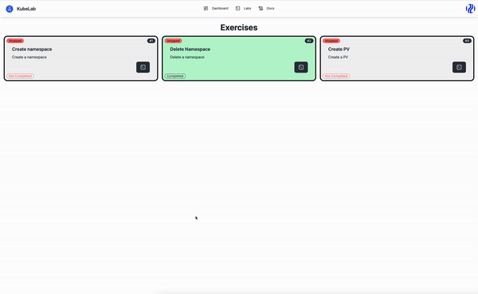

<p align="center">
    <a href="https://kubelab.natron.io">
        
    </a>
</p>

<p align="center">
  <strong>
    <a href="https://kubelab.natron.io/">KubeLab</a>
    <br />
		Experience Kubernetes Mastery Through Practice
  </strong>
</p>

<p align="center">
  <a href="https://github.com/natrontech/kubelab/issues"></a>
  <a href="https://github.com/natrontech/kubelab"></a>
	
	
	
	
</p>

<h2></h2>

KubeLab is a state-of-the-art web platform offering an immersive collection of hands-on labs designed exclusively for Kubernetes workshops. Our aim is to transform your Kubernetes learning journey into an interactive, engaging, and practical experience, helping you understand and apply complex concepts in real-world scenarios.

*Powered by [Natron](https://natron.io)*

Built with:

- [kubelab-agent](https://github.com/natrontech/kubelab-agent)
- [xterm.js](https://xtermjs.org/)
- [pocketbase](https://pocketbase.io)

<p align="center">
	
</p>

---

## Key Features

### Web Terminal
KubeLab provides a seamless in-browser terminal experience. You can execute commands and interact with your Kubernetes cluster in real time without the need for any additional setup or software.

### Cluster Per Session
Each learning session is isolated with its own Kubernetes cluster. This ensures a secure and dedicated learning environment for each user, allowing them to interact and experiment with Kubernetes without affecting others.

## Hands-on Kubernetes Labs
KubeLab offers to define your own labs and exercises. Take a look at our workshops:
- [https://github.com/natrontech/kubelab-workshops](https://github.com/natrontech/kubelab-workshops)

**Start your Kubernetes journey with KubeLab today!**

## Architecture Overview

<!-- <p align="center">
	
</p> -->

## Getting Started

### Prerequisites

- Kubernetes cluster (v1.23+)

## Installation

### Helm

*tbd*

### Docker Compose

```bash
# clone the repo
git clone git@github.com:natrontech/kubelab.git
cd kubelab

# build the images
docker compose build

# in the docker-compose.yaml is a volume mounted for the backend pb_data
# this is where the database is stored, so you might want to create a directory for it or change the path
mkdir -p ./kubelab-backend/pb_data

# start the containers
docker compose up -d
```

## Documentation

*tbd*

## Developing

### Dev Prerequisites

- [Docker](https://docs.docker.com/get-docker/)
- [Docker Compose](https://docs.docker.com/compose/install/)
- [Node.js](https://nodejs.org/en/download/) (v20+)
- [Go](https://golang.org/doc/install) (v1.20+)
- [modd](https://github.com/cortesi/modd/releases)

### Setup

Follow these steps CAREFULLY, or else it won't work. Also read the README files referred above before proceeding.

1. If using Docker then copy `.env.example` to `.env` and then edit it to match your environment. And then just run `docker compose up -d`. Without Docker, see below ...
2. Setup the backend in accordance with [./kubelab-backend/README.md](./kubelab-backend/README.md)
3. Setup the frontend in accordance with [./kubelab-ui/README.md](./kubelab-ui/README.md)

After you've done the setup in the above two README files, run
the backend and the frontend in dev mode (from `kubelab-ui` directory).

```bash
# start the backend
npm run dev:backend
# and then start the frontend ...
npm run dev
```

Now visit http://localhost:5173 (sk) or http://localhost:8090 (pb)

Now making changes in the Svelte code (frontend) or Go code (backend) will show
results (almost) immediately.

### Building

See the build process details in the README files for backend and frontend.

### Configurable Hooks

Please read about the "hooks" system in [./kubelab-backend/README.md](./kubelab-backend/README.md)
It is a very easy and powerful way to extend your application with minimal
configuration and perhaps no code.

## Contributing

> **Note:** We currently have no contribution guidelines. This will be added in the future.

Please read [CONTRIBUTING.md](CONTRIBUTING.md) for details on our code of conduct, and the process for submitting pull requests.
